Title: Shrimp, Tofu, and Wood Ear Potstickers
Date: 2014-06-09
Author: Fonda Tong
Slug: potstickers
Category:
Tags:
Summary:

One of my warmest childhood memories is making potstickers (餃子; jiǎozi) with my mom and grandma. My grandma would wake up early and prepare the doughs while we were still dreaming.

When I heard the sound of cleaver hitting cutting board, I knew that it was time to get out of bed. My mother was in charge of mincing the ingredients for the filling; usually napa cabbage and some sort of protein. After the filling was made my mom and grandma would make an assembly line of cutting and rolling out the dough. I was then tasked with filling and folding the potstickers. They were then either thrown into boiling water, a hot frying pan, or into the freezer.

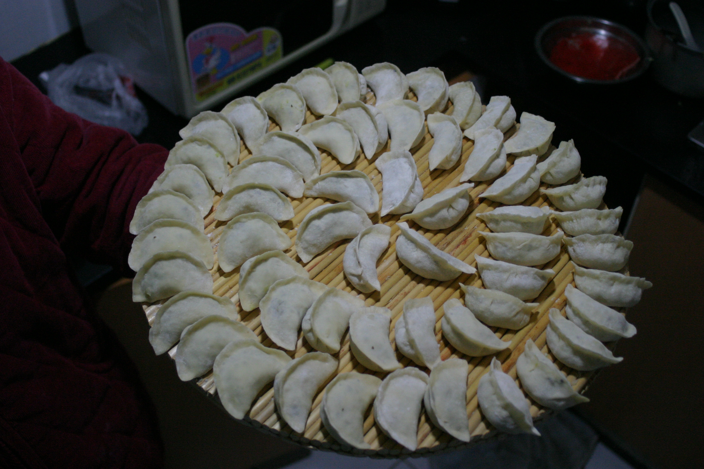
Filled potstickers from my trip to Beijing, China in 2011.

Everyone had their individual quirks for eating potstickers. My grandpa would insist on only eating steaming hot ones fresh out of the boiling water. My grandma would eat them along with a clove a raw garlic. Me, being 8, would insist on picking the filling out and only eating the skin.

I occasionally crave potstickers, and in light of the most recent craving I figured I would teach [[Tom](#)] how to make them.


You can use a food processor to chop the ingredients, but if you want to have a more traditional experience you can use a cleaver or large chef's knife. The size of the pieces of cabbage should range from rice to peas.  

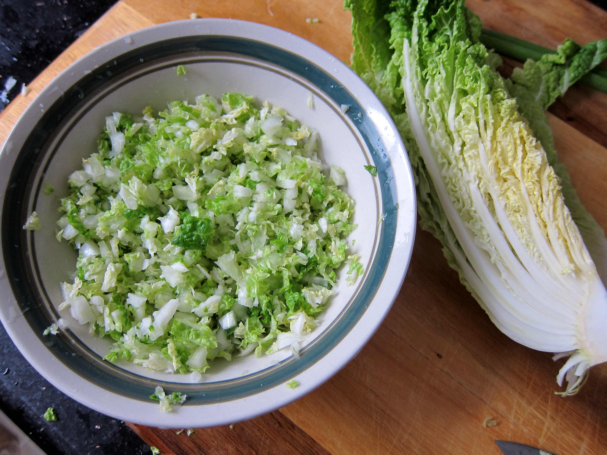

The addition of tofu makes the texture of the filling a bit softer, and the addition of the wood ear mushrooms gives an interesting crunch. Potstickers are quite versitile, so you could really fill them with anything you desire.

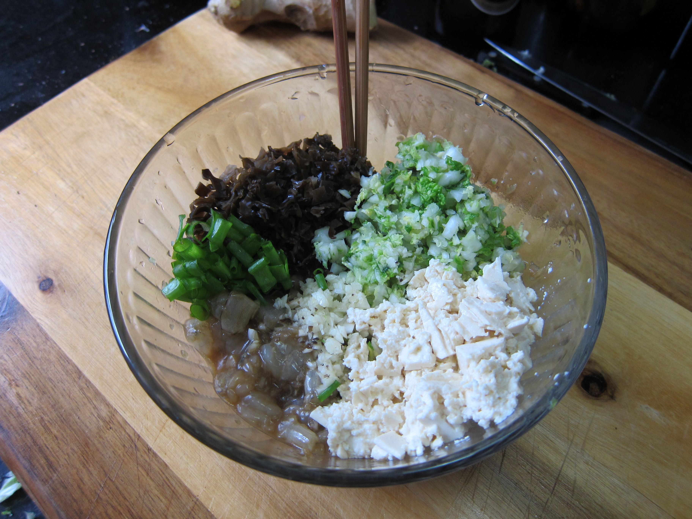

Making potstickers is a bit labor intensive for one person to do, so employ your friends and family to help you make them!

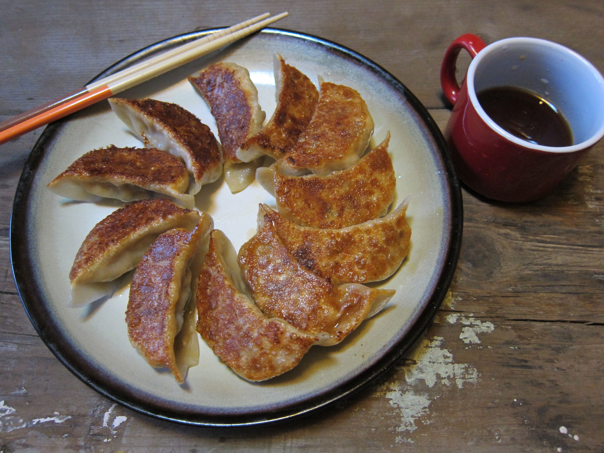

**Shrimp, Tofu, and Wood Ear Potstickers**

[See notes at bottom of recipe]

````
Ingredients:
12oz Shrimp, peeled and deveined
1/4 of a Head of Napa Cabbage
4.5oz of Firm Tofu
1 Handful of Wood Ear Mushrooms
3 Cloves of Garlic
1 Inch of Ginger
3 Stalks of Green Onion
  Salt
  Black Pepper
  Soy Sauce
  Sesame Oil
  Potsticker Wrappers
  Flour for Dusting

Equipment:
Cleaver or Large Chef's Knife
Cutting Board
Mixing Bowl
Spoon or Chopsticks
Small Bowl (For Cabbage)
Small Bowl (For Water)
Frying Pan
````

First, chop up your cabbage and place in a small bowl. Sprinkle in a pinch of salt and toss to combine. Let the cabbage sit while you prepare the other ingredients.

Cut your shrimp into 2cm pieces and place in the mixing bowl. Mince your garlic and use a microplane to grate your ginger. Mix the garlic, ginger, shrimp, soy sauce, and sesame oil. Start out with a table spoon of soy sauce, but add more if the mixture is not fragrant.

Crush the tofu with a fork or your hands and place on top of the shrimp mixture. Chop the wood ear mushrooms and place next to the tofu. Slice your green onion and place next to the mushrooms.

By now, the salt should have drawn out the water from the cabbage. Use your hands to squeeze the excess water. Place the cabbage in the bowl with the other ingredients, and mix them all together. Season the mixture with a bit of black pepper.

Now it's time to fold! Have a small bowl of water next to you, and make sure to keep your potsticker wrappers covered so they don't dry out.

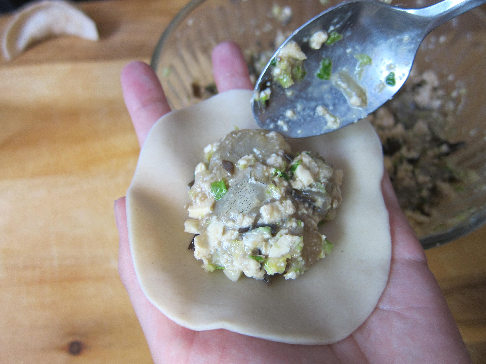

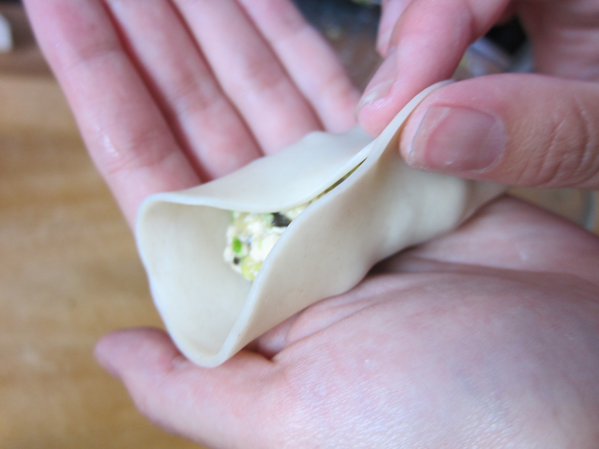

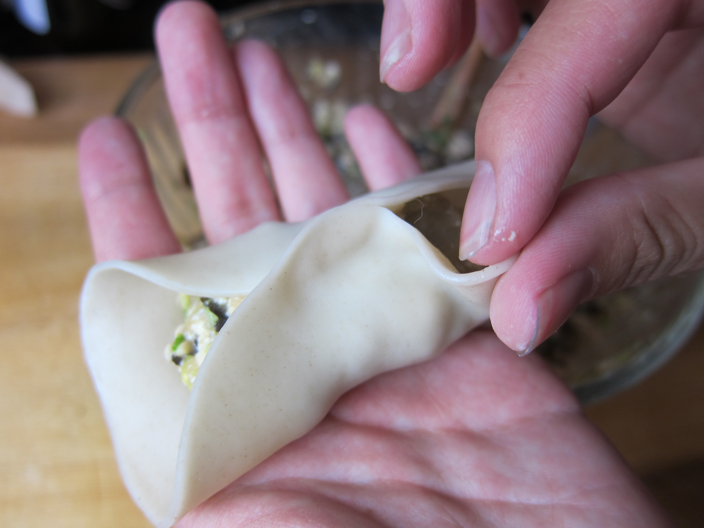

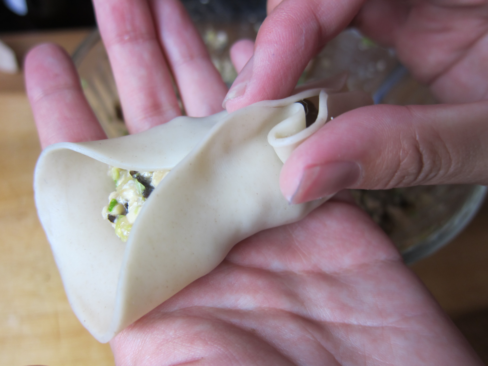

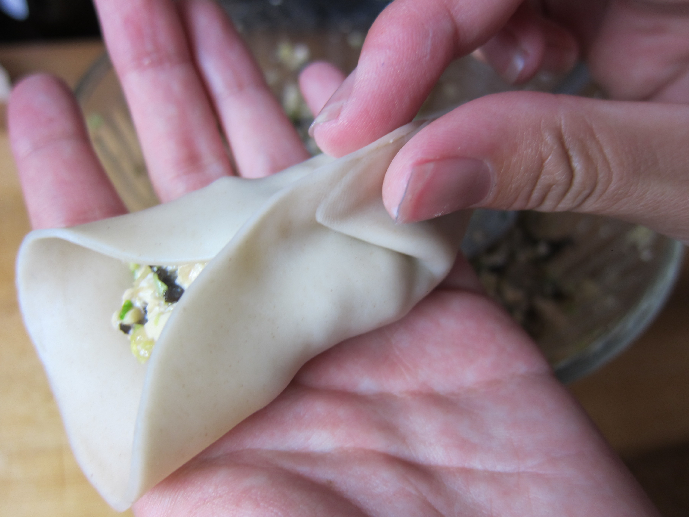

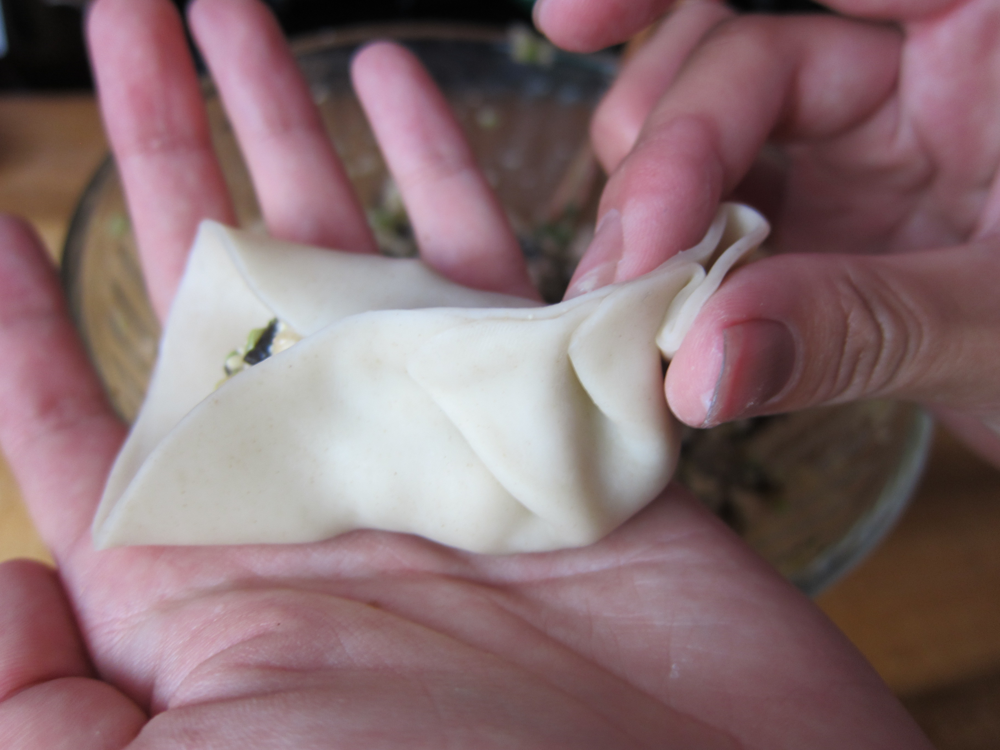

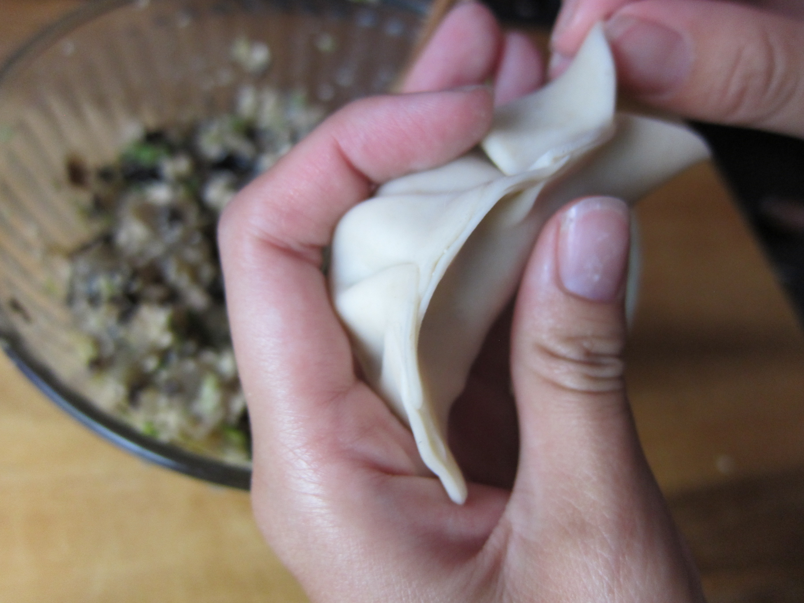

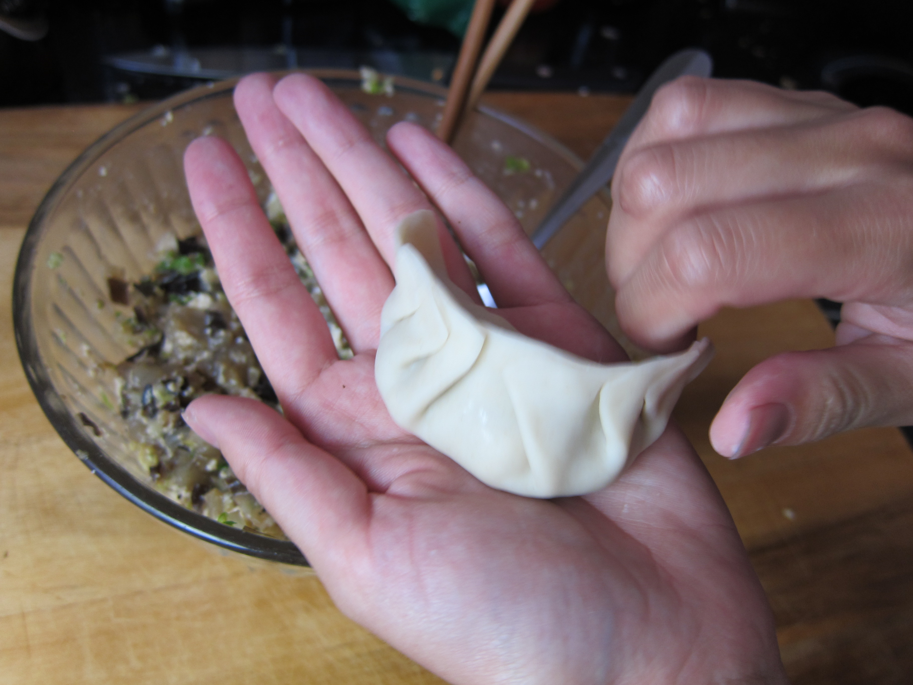

**Notes:**

*You can make your own dough, but to save some time and effort we used store bought potsticker dough. This may be a bit hard to find, but most grocery stores sell wonton skins which would be an adequate substitute.

*These potstickers are excellent to freeze for a later time. After you are done folding, place them on a lightly floured cookie sheet and then into the freezer. After they are frozen you can transfer them into a large zip-top bag.
